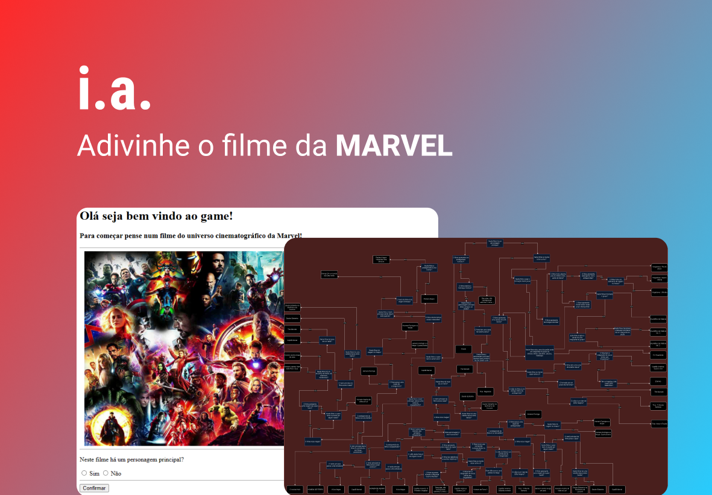

<h1 align="center"> IA_adivinhe_o_filme_do_UCM </h1>

Minha primeira experiência programando uma I.A. assim como criando um mapa de soluções

  <a href="#-tecnologias">Tecnologias</a>&nbsp;&nbsp;&nbsp;|&nbsp;&nbsp;&nbsp;
  <a href="#-projeto">Projeto</a>&nbsp;&nbsp;&nbsp;

 

  

## 🚀 Tecnologias

Esse projeto foi desenvolvido com as seguintes tecnologias:

- HTML e CSS
- JavaScript
- Git e Github
- Draw.io

## 💻 Projeto

O projeto foi feito a partir do exercício passado em aula da disciplina de Inteligência artificial
Feito no quinto semestre da faculdade de Ciência da Computação na Uniritter.
